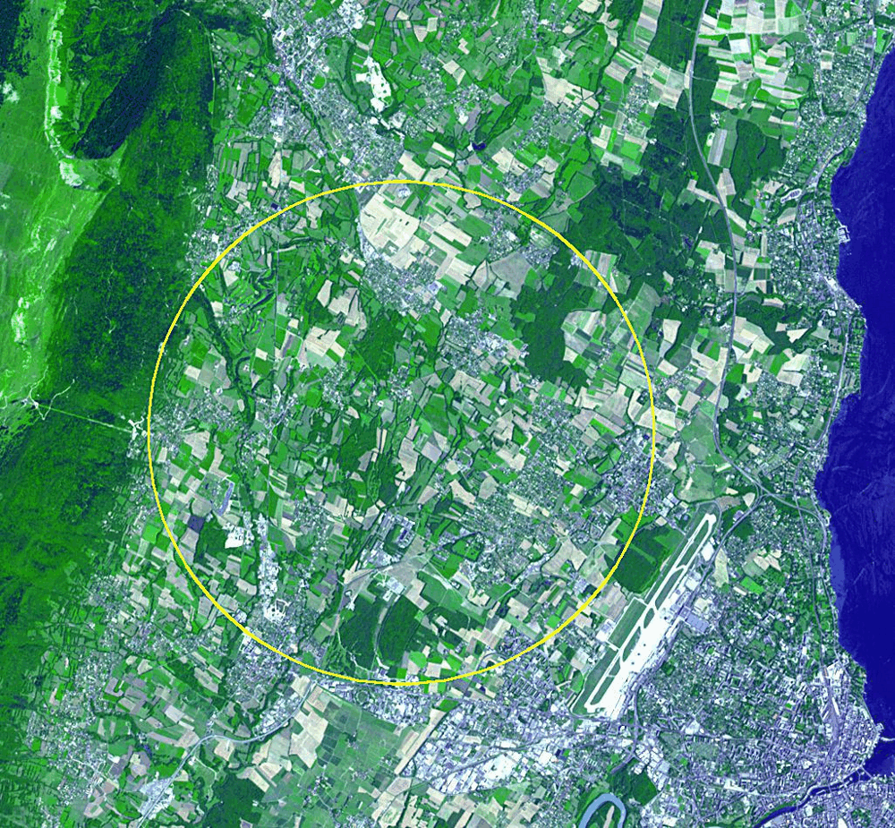

# Guide for Spanish Nationals Starting Work at CERN (Social Security & Taxation)

<strong>⚠️ Legal Notice</strong> 

This page is for general informational purposes only. It does not constitute legal, financial, or tax advice. The content is not official and should not be used as a substitute for professional guidance. Please consult a qualified advisor for your specific situation.

Beginning a new position at CERN – whether in Geneva, Switzerland or in Pays de Gex, France – involves unique administrative steps for Spanish nationals. CERN is an international organization with its own internal tax and social security systems, which means your situation will differ from a typical job in Spain or the EU. This guide provides a practical roadmap focusing on social security and tax obligations, covering what to do from the Spanish perspective, the differences between being based in Switzerland vs. France, and the implications for short-term vs. long-term stays. We also include example scenarios and key resources to help you navigate the bureaucracy smoothly.

## Before You Move: Spanish Social Security Registration & Preparations

Before relocating, Spanish nationals should take a few steps to ensure compliance and protect their rights:

- **Register at the Spanish Consulate:** If you move abroad, inform the Spanish authorities by registering as a resident at the nearest Spanish Embassy/Consulate. This "consular registration" is required for certain processes (e.g., signing up for special social security agreements) and ensures you remain on record as an emigrant. It also provides access to consular services while abroad.
- **Spanish Social Security – Convenio Especial (voluntary coverage):** When you work at CERN, you will not be contributing to the Spanish Social Security system by default (CERN has its own pension and insurance schemes). To avoid gaps in your Spanish social security record, you can voluntarily continue contributing in Spain via a *Convenio Especial* for emigrants (special agreement). This is a personal agreement with the Tesorería General de la Seguridad Social (TGSS) that allows you to pay monthly contributions to maintain coverage for certain benefits:
  - **What it covers:** The convenio especial for Spanish emigrants covers retirement (*jubilación*), permanent disability, and death/survivor pensions. It also ensures you retain access to public healthcare in Spain as an emigrant. **Note:** It does not cover unemployment benefits or temporary disability, since you won't be paying into those contingencies.
  - **Cost:** You pay the contributions yourself (no employer contribution). The cost is based on the minimum contribution base and standard rate, with a reduction factor. For example, in 2024 the minimum base is €1,323/month; applying the 28.3% rate and reduction coefficient (0.77) yields about €288 per month (paid quarterly, ~€864/quarter). This amount may adjust over time as bases and rates change.
  - **How to sign up:** You must apply for the convenio within 90 days of leaving your last job in Spain (to avoid gaps). Fill out model TA.0040 (Convenio Especial application) and submit it to TGSS. You can do this via the Seguridad Social Electronic Office (Import@ss) or through the provincial TGSS office (often via mail or the labor attaché at the consulate). Along with the form, you'll need to provide:
    - A copy of your DNI or passport.
    - Proof of your residence abroad (e.g. a copy of your CERN legitimation card or French residence document), certified by the Spanish consulate.
    - Proof of employment or research activity at CERN (such as your CERN contract or a certificate of employment), also endorsed by the consulate.
    - If you weren't previously in the Spanish system, you may also submit a TA.1 form to get a social security number.
  - **Effect of signing the convenio:** Once approved, you'll be affiliated to the Spanish system in an "assimilated high" status (as if you were employed for covered contingencies). You must pay the quarterly bills that TGSS will issue (ensure you have a Spanish bank account for the direct debit). The convenio remains in effect as long as you keep paying, until you terminate it or return and resume normal contributions. It can typically be suspended or ended if you stop paying or if you become a pensioner, etc., per the rules.
  - **If you do NOT sign the convenio:** It's not mandatory – it's a personal decision. However, be aware that not contributing in Spain means that period won't count for your Spanish pension. You will be relying solely on CERN's own pension scheme for those years. If you already have contributions in Spain or plan to return to Spain in the future, consider how a gap of a few years will affect your "cotización" record. (For example, if you had 12 years of contributions in Spain, spent 3 years at CERN with no Spanish contributions, then returned to work in Spain, you'd still have 12 years on record — potentially below the 15-year minimum for a Spanish state pension.) In contrast, maintaining contributions via the convenio would give you continuous coverage and a larger total for pension calculation later.
  - **Short-term (<2 years) vs Long-term (>2 years) stays:** If your CERN position is short (e.g. a 1–2 year fellowship), you might weigh the cost-benefit of the convenio especial. A short gap in contributions may have a minor impact on a 30+ year career, especially if you plan to work longer to reach retirement age. In some cases, Spaniards on very short assignments might even keep their Spanish residence or be on unpaid leave (*excedencia*) from a Spanish job – but in most cases a CERN fellow is a standalone job. For longer stays (beyond 2 years) or an indefinite contract, it's generally advisable to maintain the Spanish social security link via the convenio if you intend to eventually return to Spain, since the gap could significantly affect pension entitlements. Remember that under EU rules, workers posted by a Spanish employer abroad can stay in home-country social security up to 24 months, but CERN employment is not a posting by Spain – it's a direct job, so that EU "A1 certificate" system does not apply here. The convenio especial is the mechanism for continued Spanish coverage once you leave the Spanish system.

With these preparations in mind, let's break down the specifics for each scenario: working at CERN in Switzerland vs. France, as the host country can affect certain practical requirements.

## Scenario 1: Working at CERN in Switzerland (Geneva)

<figure class="figure-inline">
<picture class="figure-inline__media">
  <source srcset="../images/sat_cern.webp" type="image/webp">
  
</picture>

<figcaption class="figure-inline__caption">
  <strong>Figure:</strong> A satellite image of the CERN area, with the 27-km Large Hadron Collider ring (yellow circle) beneath the
  French–Swiss border near Geneva. Spanish CERN staff in Geneva benefit from international status, affecting
  tax and social security obligations.
</figcaption>
</figure>

### Social Security (Spain & Switzerland)

If your CERN contract lists your duty station as Geneva (Switzerland), you will receive a Swiss legitimation card (a diplomatic-type ID for international officials) and will not pay into Swiss social security. In fact, neither you nor CERN will contribute to any national social security system (Swiss or Spanish) for your CERN salary – CERN has its own comprehensive system for pensions and insurance. Key points include:

- **CERN Pension Fund & Health Insurance:** As a CERN fellow/staff, you're automatically covered by CERN's internal schemes. The CERN Pension Fund is a defined-benefit plan that provides for old-age and disability pensions, similar to a state social security pension. CERN also provides a Health Insurance Scheme (CHIS) for illness, accidents, and maternity. This internal health insurance covers treatment in both Switzerland and France (and abroad for travel), so you and your dependents are well protected.
- **Exemption from Swiss systems:** Under the Protocol on Privileges and Immunities (which Spain and Switzerland have ratified), CERN and its staff are exempt from compulsory contributions to national social security. This means you do not pay Swiss pension (AVS/AHV), unemployment, or Swiss health insurance. Normally, residents in Switzerland must take out Swiss health insurance (LAMal), but CERN personnel with a legitimation card are exempt from that requirement. You may voluntarily purchase Swiss health insurance if you wish, but this is usually unnecessary because CERN's CHIS is adequate. (Family members with legitimation cards are also exempt from Swiss health insurance mandates, while those without such status – e.g. a spouse working in the local economy – would need coverage under Swiss or French rules.)
- **Spanish Social Security obligations:** From Spain's point of view, once you start working in Geneva you are considered an emigrant worker. You will have been given a "baja" in Spanish Social Security when you left your last job in Spain. Because of CERN's special status, you will not be paying Spanish social security through any automatic mechanism. The onus is on you to arrange coverage via the Convenio Especial if you want to keep contributing in Spain (see "Before You Move" above). Spain does not require any other social security registration while you're abroad, apart from the voluntary convenio. It's recommended to keep evidence of your CERN employment (contracts, CERN HR letters) and the consular registration, in case Spanish authorities request proof that you were employed abroad (e.g. for validating your convenio especial or when you eventually claim a pension).

**Coverage and benefits:** While in Switzerland, your day-to-day social security needs (healthcare, family allowances, etc.) are largely handled by CERN internally. For example, CERN provides family/child allowances and has internal rules for maternity/paternity leave, disability insurance, etc. This means you typically won't interact with Swiss social security for benefits. If you need medical care in Switzerland or France, you use the CERN health insurance (which reimburses costs; you might also get a CERN-issued insurance card). If you travel back to Spain for visits, you can use your CHIS coverage for emergency care or scheduled care (CHIS might reimburse or you could use private services).

Note that since you're not paying into Spanish social security (unless via convenio), you generally wouldn't use a Spanish Tarjeta Sanitaria as a resident (unless you maintain residency in Spain, which most do not). If you did sign the convenio especial, you have the right to healthcare in Spain as an emigrant, so you could obtain documentation (an S1 form or equivalent) to show that Spain covers your health while abroad. However, because CERN's health insurance is primary, in practice many do not utilize the Spanish health system until they return home. It's good to know that signing the convenio keeps your Spanish public healthcare access alive for when you return.

**Short vs long stay considerations:** For Geneva postings under ~2 years, you might feel the Spanish convenio is optional – for a brief fellowship, some people choose not to pay €288/month and accept a small gap in pension contributions. If you plan to return to Spain soon, also consider unemployment (addressed below): a short stint might leave you without coverage for unemployment benefits on return, since you paid no Spanish unemployment contributions while at CERN. For longer appointments or permanent positions, maintaining Spanish contributions can be very important if you intend to retire in Spain or need to ensure continuity of your pension rights.

<strong>💡 Example:</strong> 
María worked 5 years in Spain before her 3-year CERN fellowship in Geneva. She decided not to sign the convenio during those 3 years. When she returns to Spain, she has still only 5 years of contributions in Spanish Social Security (her CERN time doesn't count). She will need at least 10 more years of work in Spain to reach the 15-year minimum for a Spanish pension. Had she contributed via the convenio during CERN, she would have 8 years on record, needing 7 more. In María's case, if she is confident she'll work many years in Spain after CERN, she might save money by not paying the convenio; but if her post-CERN plans are uncertain, the convenio would have safeguarded her pension eligibility.

### Tax Obligations in Switzerland (and Spain)

One of the biggest adjustments for CERN staff is the tax regime, which is very different from normal employment. CERN levies its own internal tax on your salary, and in return the Host States and Member States do not tax your CERN income. Here's what to know for the Swiss scenario:

- **No Swiss income tax on CERN earnings:** Each month, CERN deducts an internal tax (analogous to an income tax) from your salary according to its own scale. Because of this, the salary and family allowances paid by CERN are exempt from Swiss federal, cantonal, and communal taxes. In practical terms, you do not file a Swiss income tax return if CERN is your only income and you are a foreign national. The Geneva tax authorities don't require non-Swiss CERN staff to file a return in most cases. (*Exceptions:* if you have significant outside income or property in Switzerland, you might need to declare those. For example, owning Swiss real estate or having a side business could trigger an obligation to file a Swiss return, declaring those external incomes. But your CERN salary itself remains tax-free in Switzerland.) Swiss members of CERN's personnel do file but likewise do not list CERN income, only noting they are internally taxed.
- **Internal taxation certificate:** CERN will provide you each year with an "Internal Taxation Certificate" stating that your CERN income was subject to internal tax. If you ever are asked by a Swiss tax office to prove your status, you can supply this certificate. Typically, non-Swiss employees residing in Switzerland won't even receive a tax form from the canton unless they have other taxable income. If you inadvertently get one, you usually just inform the tax office of your status. (Swiss spouses of CERN staff living in Switzerland may have to file and declare the situation – they themselves are exempt on CERN income but still must report other income or assets.)
- **Spanish taxation of CERN income:** Spain is a CERN Member State and is a signatory to the Privileges Protocol. If you remain a tax resident of Spain while working at CERN, your CERN remuneration is exempt from Spanish income tax as well. In practice, however, most fellows who move to Geneva will become non-resident in Spain for tax purposes – you'll be living and working abroad full-time. Spain determines tax residency by whether you spend more than 183 days in Spanish territory in the calendar year, among other criteria. Once you move to Geneva and cut ties (e.g. no home, and your family moved with you), you typically become a non-resident of Spain, meaning you won't file annual Spanish IRPF returns at all during your contract. If for some reason you kept Spanish tax residency (for example, your family stayed in Spain and you return often, potentially invoking the "center of vital interests" rule), Spanish law still grants an exemption for income from international organizations. Article 10(b) of the CERN Privileges Protocol (ratified by Spain in 2007) explicitly states that CERN salaries are exempt from national income tax, since you pay the internal tax. So either way, your CERN earnings are not taxed by Spain. (**Do note:** This exemption applies only to your CERN employment income. If you have other income still sourced in Spain – say you rent out your Spanish flat while in Geneva – that income may still be taxable in Spain or Switzerland depending on the case, so you might have to file a non-resident tax return in Spain for the rent, for example.)
- **Other taxes and practicalities:** Even though you don't pay Swiss income tax, if you live in Switzerland you may encounter other local taxes or duties:
  - **VAT (IVA):** when you purchase goods or services in Switzerland, local VAT applies (though some shopping can be duty-free at CERN stores). CERN privileges don't generally exempt you from paying sales taxes in shops, except under certain conditions on big purchases (there are diplomatic-type tax reliefs on substantial items or on imports for personal effects, as per CERN's status agreements).
  - **Communal taxes:** Some communes charge minor fees (e.g. garbage fees) unrelated to income. These might apply since you reside there.
  - **Vehicle and road taxes:** If you register a personal car in Geneva, you pay the canton's road tax, etc. Again, no exemption for those as they're not income taxes.
  - **Wealth/asset tax:** Geneva (and Switzerland) have an annual wealth tax for residents. If you have significant assets, technically as a resident you might be liable for cantonal wealth tax. However, many CERN foreigners keep assets abroad and/or fall below thresholds. This is a complex area – if relevant, consult the Geneva tax authorities or a tax advisor. (Some international civil servants who are permanent residents handle this; as a fellow on a time-limited stay, it may not apply if your assets are modest.)
- **Tax declaration in Switzerland:** As noted, you likely won't file one. Non-Swiss CERN staff residing in Geneva are "not normally required to complete an income tax declaration form" unless they have other taxable income or assets. If you do need to file (rare), you would not list CERN income, only other taxable items, and attach the CERN tax certificate.
- **Summary:** In Switzerland, your CERN pay is only taxed at the source by CERN. You do not pay Spanish IRPF or Swiss income tax on it, thanks to the international agreement. This often means a higher net income compared to a similar gross salary in a normal job (since CERN's internal tax is usually lower than combined national taxes). Take into account, however, that you won't be contributing to Spanish public pension or unemployment funds during this time (unless you voluntarily do so), as discussed above. It's wise to save a portion of your salary or contribute to the convenio for long-term security.

<strong>💡Example Scenario (Switzerland):</strong> 
 Carlos, a Spanish junior engineer, gets a 2-year CERN fellowship in Geneva. He leaves his job in Spain and moves to Switzerland. Here's how he handles his obligations:

<ul>
<li><strong>Before leaving:</strong> Carlos registers with the Spanish consulate in Geneva and applies online for the convenio especial to keep his Spanish pension contributions going. He provides his CERN offer letter and, a month later upon arrival, a copy of his Swiss legitimation card to the TGSS via the consulate. He starts paying ~€290/month to the Spanish system.</li>
<li><strong>In Geneva:</strong> Carlos rents an apartment. As a CERN staff member, he is exempt from Swiss health insurance, so he sticks with CERN's CHIS coverage which reimburses his medical bills. He does not register for any Swiss social security; his "carte de légitimation" from the Swiss Mission suffices for residency.</li>
<li><strong>At tax time:</strong> Carlos does not receive a Swiss tax form (since he's a foreign CERN fellow with no other income). He also does not file a Spanish tax return because he spent less than 183 days in Spain and has moved his residence. CERN gives him an internal tax certificate showing he paid CERN internal tax on his income, which he keeps on file. His income isn't taxed by Spain.</li>
<li><strong>After 2 years (end of fellowship):</strong> Carlos returns to Spain. Thanks to the convenio especial, he has no gap in his Spanish pension record. However, because he voluntarily left Spain for CERN, he did not accumulate any Spanish unemployment rights while abroad. He plans his return knowing he cannot claim "paro" immediately (see the "Returning to Spain" section below). He budgets savings from his CERN salary to cover him until he finds a new job in Spain.</li>
</ul>

## Scenario 2: Working at CERN in France (Pays de Gex / Prévessin)

CERN's campus spans both Switzerland and France. Some fellows are contracted to work on the French side (e.g., at CERN's Prévessin site or other facilities in Ain, France). In terms of CERN employment conditions, you remain an international civil servant with the same internal tax and CERN social systems. However, living/working in France introduces a few different administrative steps compared to Switzerland.

### Social Security (Spain & France)

- **Exemption from French Social Security:** Just as in Switzerland, CERN employees in France do not contribute to the French social security regime. France has an agreement with CERN (the 1965 France–CERN Headquarters Agreement) which grants CERN staff immunities. You will not pay into Caisse d'Assurance Maladie, Caisse de Retraite, UNEDIC, etc. for your CERN salary. CERN's internal Pension Fund and CHIS health insurance cover you instead, providing "equivalent social protection" as required by the Protocol. *This means:*
  - You won't have a French *sécurité sociale* number through CERN employment (since you're not in the French system). Your health coverage is through CHIS, not through CPAM.
  - You won't accumulate French state pension credits or unemployment insurance rights, because no contributions are paid there.
- **Residence in France (EU citizen):** As a Spanish citizen, you have the right to reside in France. France typically requires EU nationals staying >3 months to register their residence, but in practice it's straightforward (often just obtaining an EU resident card is optional). However, since you are an international organization official, France may issue you a special carte de légitimation or otherwise attest your status via the French Ministry of Foreign Affairs. (For example, UN agencies in France issue "carte PRO" or similar to staff. CERN staff in France might be covered by the Swiss legitimation card as well – the Swiss "P" or "H" card types are recognized by France for border crossing and status purposes.) Be sure to clarify with CERN HR what documentation you and your family need to reside in France legally. Usually, with your CERN contract and either the legitimation card or an attestation, you fulfill French requirements without needing a separate work permit.
- **French health insurance (PUMA) opt-out:** Normally, residents in France who aren't otherwise covered must join the universal health system (PUMA) and pay contributions or have private insurance. CERN personnel with privileges are exempt from mandatory French health insurance because you already have coverage (CHIS). France recognizes the CERN scheme as adequate. You will want to ensure your CERN health insurance card is valid in France – CHIS does cover treatment in France (CERN requires that any private insurance for users covers both France and Switzerland, and CHIS of course does). If you ever use French medical services, you might pay upfront and get reimbursed by CHIS, since you won't have a French *sécurité sociale* number to charge directly (unless CERN has direct billing arrangements for some hospitals). Some staff choose to also get the European Health Insurance Card via CHIS for travel in Europe, but note CHIS isn't an EU national scheme, so typically you'd rely on CHIS's own processes for cross-border care.
- **Spanish Social Security considerations:** From Spain's perspective, working on the French side of CERN is no different than the Swiss side – you are still not contributing to Spanish Social Security unless by convenio. So all the advice from earlier ("Before You Move") on registering and optionally signing the convenio especial applies equally here. One small difference: if you are residing in an EU country (France) while on leave from Spain, there is a coordination mechanism where, had you been sent by a Spanish employer, you would carry an S1 form to transfer healthcare rights. But since you are directly hired by CERN, you cannot get an S1 from Spain (you're not paying Spanish contributions, so Spain won't cover your health in France; CERN covers it instead). Thus, the convenio especial doesn't give you an S1 for France (S1 is only for people remaining under the Spanish system), but it does keep your Spanish health rights for when you return to Spain or if you go there temporarily. In summary, being in France doesn't let you use the EU social security coordination because CERN is outside that system.
- **Administrative note – French Social Security Number:** Occasionally, you might need a French Social Security number for certain administrative purposes (for instance, French tax forms ask for a *numéro de sécurité sociale* as an identifier, or doctors might ask for it). If you're not in the French system, you can usually explain that you are covered by an international organization scheme and thus have no French number. The French tax office can issue a tax identification number (separate from a social security number) for you to file taxes (discussed below). If you later take up non-CERN work in France, you'd then get a social security number at that time.
- **Family considerations (frontier workers):** If, for example, your spouse works in Switzerland but you live in France (a common scenario: one spouse at CERN, the other employed by a Swiss company), the spouse would be a *frontalier* subject to special rules. France usually requires frontier workers or their families to choose either the French or Swiss health system (under bilateral agreements). However, CERN staff and their registered family are treated under the privileges regime – e.g., your spouse holding a "P" legitimation card as your family member would also be exempt from mandatory affiliation. If your spouse works outside CERN, they will follow the normal rules for their job (not our focus here). Just be aware that your unique status might confuse local officials (e.g., CPAM might not know what to do with you if you tried to register – the answer is you don't need to). CERN's Users Office and HR can provide guidance on these cross-border family insurance questions.
- **Short vs long stay:** Living in France, you might feel more integrated into an EU country, but don't let that give a false sense of social security coverage – you still must actively maintain Spanish contributions if you want, as France gives you no credit for CERN time. If you only stay a short while at CERN (say 1–2 years in France) and then move to another EU job, note that when you later apply for pensions, the French pension office will not have any record of you for those years. And since CERN is not an EU social security institution, you cannot totalize CERN time under EU pension coordination. Plan accordingly with the convenio or by making up years later.

### Tax Obligations in France (and Spain)

As a CERN employee residing in France, you fall under French tax jurisdiction as a resident. France, like Switzerland, exempts CERN salaries from income tax, but you will likely need to file a French tax return to declare your situation. Also, being in the EU, you might still have some ties to Spain to consider. Here's how to manage taxes:

**French income tax returns:** Unlike Geneva, where many foreign CERN folks never file a return, in France you generally must file an annual tax declaration because you are a resident. The good news is that your CERN income is not taxed by France (thanks to privileges), but you do need to report it in a specific way. Each spring, you will fill out a French income tax form (now usually done online). In the form, you do not include your CERN salary under "salaire imposable." Instead, you will tick certain boxes and add a note to inform the tax authorities that your CERN income is tax-exempt due to internal taxation. For example, CERN's guidance (in cooperation with local French tax offices) is that staff should not list their CERN earnings under employment income, and should add an "information expresse" note stating: "*Membre du personnel du CERN assujetti à l'impôt interne du CERN et, à ce titre, exonéré d'impôt sur les prestations versées par le CERN*". This explains that you're CERN personnel subject to CERN internal tax and therefore exempt from tax on that income. You will attach your CERN Internal Tax Certificate to the declaration as proof. There are specific boxes in the French form to tick for having foreign exempt income. For instance, you tick the section for "revenus de source étrangère exonérés" and provide the amount in the informational fields (it won't be taxed). The exact box numbers can change, but CERN usually provides an e-guide or FAQ each year with instructions. (In the simplest case, as a staff member with only CERN income, you just declare that you have exempt foreign income and supply the internal tax certificate.)

Bottom line: you'll probably owe zero income tax in France if CERN was your only earnings. However, if you have other income (like a spouse's salary, rental income, investment income), France will tax those under normal rules. Your French tax rate might be influenced by your total worldwide income (for example, France uses a mechanism where exempt income can be considered to determine your tax rate on other income, via the *taux effectif*). But since CERN incomes are typically fully exempt by international convention, in practice France usually just ignores it except for informational purposes. Check the latest guidance or consult the local tax office in Pays de Gex (often the SIP office in Gex or Bellegarde that handles CERN cases) if you have complexity. CERN's admin e-guide provides contacts for the Valserhône SIP (Service des Impôts) which is familiar with CERN personnel cases.

**Spanish tax residency:** When you move to France, you will almost certainly become a tax resident of France (spending >183 days there, having your principal home there). Thus, you would be non-resident in Spain for tax purposes. You should inform the Spanish tax agency by filing Modelo 030 (change of address/tax residence) if you had been filing in Spain, to avoid any confusion. As a non-resident, Spain will only tax any Spanish-source income you have (for example, if you keep a property in Spain and rent it out or sell it, you'd file a non-resident tax return on that income). Otherwise, you won't file annual Spanish returns. And as noted earlier, even if you somehow were considered Spanish tax resident, your CERN salary is exempt by treaty. So either way, Spain will not tax your CERN earnings. You might still want to keep documentation like the BOE publication of the Privileges Protocol or your CERN certificate in case you need to demonstrate the exemption to Spanish authorities at any point.

**French local taxes:**

- **Taxe d'habitation and Taxe foncière:** local residency and property taxes. If you rent, usually the taxe d'habitation (residence tax) may apply, though recent reforms have eliminated most of it for primary residences. If you buy property, *taxe foncière* (land tax) applies. CERN status does not exempt these – you pay them like any resident.
- **VAT and duties:** All your purchases in France include TVA (VAT). No exemption (except you might be able to shop in CERN's duty-free shop on the Swiss side for certain goods, but that's minor). If importing personal goods to France when you move, your status might ease customs, but generally EU free movement already covers that for EU citizens.
- **Social charges:** France sometimes levies social charges (CSG/CRDS) on investment income or capital gains, even for exempt individuals. However, as an international official and non-French EU citizen, you may be able to avoid some of these if not in the French social system. This is a niche issue: e.g., if you have savings interest or rental income in France, usually residents pay CSG on it. There have been court cases exempting those not in the French social security system from CSG on foreign income. If this applies (say you earn interest in Spain but are a French resident), seek tax advice – it's beyond the scope here, but know it exists.

**CERN Internal Tax:** Just like in Switzerland, CERN will deduct internal tax from your salary before paying you. You'll get the yearly certificate of internal tax paid, which you use for your French declaration. The certificate essentially keeps both France and Spain off your back regarding income taxes on that money.

<strong>💡 Example Scenario (France):</strong> 
 Laura, a Spanish researcher, is hired as a CERN fellow based in Prévessin (France). She lives in nearby St-Genis-Pouilly. Here's how her situation unfolds:

<ul>
<li><strong>Convenio and consular registration:</strong> She signs up for the convenio especial with Spanish TGSS to continue her Spanish pension contributions while at CERN. She registers with the Spanish Consulate in Lyon (which covers her region).</li>
<li><strong>Health coverage:</strong> In France, she doesn't enroll in the French <em>sécurité sociale</em>. Instead, she uses the CERN health insurance for herself and her child. When the child needs to see a French pediatrician, she pays the fee and submits a claim to CERN's insurer for reimbursement. She informs the French CPAM that she is covered by an international scheme (if ever asked).</li>
<li><strong>Tax filing in France:</strong> Laura creates an account on <a href="https://impots.gouv.fr" target="_blank" rel="noopener noreferrer">impots.gouv.fr</a> to file her taxes (she'll need to get a French tax number via that process). In her first French tax return, she declares zero taxable employment income, ticks the relevant boxes for exempt CERN income, and attaches her CERN tax attestation. She also declares the small rental income she still receives from renting out her flat in Spain – that part is taxable in Spain (she pays Spanish non-resident tax on it) but under the France-Spain tax treaty, Spain gets to tax the rent and France will not tax it again (she still reports it in France, possibly with a tax credit of equal amount to avoid double taxation). Essentially, her French tax liability remains low; she ends up owing only a token amount for some interest income.</li>
<li><strong>Daily life and taxes:</strong> Laura pays her French housing tax and notices her utility bills include TV license fees – normal life as a resident. But her CERN salary itself remains fully untouched by French taxation.</li>
<li><strong>After CERN – Unemployment:</strong> When her contract ends after 3 years, Laura decides to remain in France to look for jobs. Because she didn't contribute to French unemployment insurance, she is not eligible for the standard French unemployment benefit (<em>Allocation d'aide au retour à l'emploi</em>). Nor can she get Spanish "paro" unless she returns to Spain and meets the contribution requirements there. She can, however, register with Pôle Emploi (the French job center) as a jobseeker. They might offer her career services but no insurance payouts. If she remains unemployed long-term in France with limited resources, she might eventually apply for RSA (<em>revenu de solidarité active</em>, a welfare benefit) – but that's a last resort. Typically, she plans to find a new job quickly, possibly at another research institute in France, after which she'll start contributing to French social security normally.</li>
</ul>

## Returning to Spain: Unemployment and Pension Implications

Whether you spend a couple of years at CERN or a full career, at some point you may return to Spain. It's crucial to understand how your CERN tenure will be recognized (or not) by Spanish systems:

### Unemployment Benefits ("el paro")

Time worked at CERN does not count for Spanish unemployment insurance (*prestación por desempleo*). Spanish unemployment benefits require that you have contributed to the Spanish unemployment fund (part of social security) through salaried work in Spain or through EU/Bilateral-agreement countries that transfer the credits. CERN is outside these mechanisms – it has no unemployment contributions and is not covered by EU social security coordination. This means:

- If you quit a job in Spain to go to CERN, you generally have no right to claim Spanish unemployment when leaving for CERN (also because you left work voluntarily).
- If you finish your CERN contract and return to Spain without a job, you cannot claim unemployment benefit based on your CERN work, since no contributions were made to Spain for that period.
- If you had accumulated unemployment credits before (for example, you worked in Spain for several years, then left for CERN without ever claiming unemployment), note that those credits remain usable for a period (Spain uses a 6-year look-back for unemployment). After a long stay abroad, some of those contributions may fall outside the look-back window and effectively expire for benefit purposes. **Example:** Juan had 3 years of contributions in Spain, but he didn't need unemployment and went to CERN for 5 years. When he comes back, those contributions are now 5–8 years old. To qualify for *paro*, he needs at least 360 days of contributions in the last 6 years. His old contributions are at the edge of 6 years; if he doesn't find a Spanish job immediately, they will slip past 6 years and he won't qualify until he works again for at least a year in Spain.

**Plan ahead:** If you expect to return to Spain, be prepared that you might not have an unemployment safety net. It's wise to save money from your CERN salary to cover a job search period. Alternatively, some choose to transfer to another EU job after CERN, in which case they might consolidate their social security elsewhere before coming back to Spain. (Since France and Switzerland won't have unemployment coverage for you, this mostly matters if you move to another country's system after CERN.)

### Retirement/Pension Recognition

- **CERN Pension:** If you worked at CERN long enough to vest in the CERN Pension Fund (CERN's rules determine the vesting period; fellows sometimes have shorter terms that pay a leaving indemnity rather than a pension, whereas staff with longer service get a pension), CERN's pension is separate from any state system. If you are entitled to a CERN pension, it will be paid out by CERN, and Spain will tax that pension normally (**important note:** while salaries were exempt, national taxes can apply to pensions from international organizations – the CERN protocol allows states to tax pensions of former officials. For instance, if you retire in Spain and receive a CERN pension, Spain will treat it as income and tax it under IRPF, unless future law changes). Keep documentation of your CERN contributions and pension rights for when you navigate this later.
- **Spanish State Pension:** If you maintained or later accrued sufficient Spanish contributions (15 years minimum, with at least 2 years in the last 15 before retirement, under current rules), you can get a Spanish public pension. The years you paid the convenio especial count as if you were working in Spain for pension purposes. If you did not pay the convenio, those years at CERN are simply blank in your Spanish record. They cannot be filled by "buying back" later (Spain generally doesn't allow retroactive contributions except through the convenio at the time or in certain very limited cases). So, your Spanish pension will be calculated based on the contribution years you do have. Spain will not give you any credit for CERN years – except if you contributed in another country's public system in the meantime, which isn't the case here.
- **Totalization with other countries:** If you worked in France outside CERN, or in another EU country's system, those periods can be summed with your Spanish periods under EU regulations to determine eligibility and pro-rata pensions. But CERN time cannot be included in those totalizations as it's not part of any national system.
- **Using convenio years in pension:** Convenio especial contributions are treated like General Regime contributions for pension calculations. So if you contributed at the minimum base, your eventual pension from Spain will reflect those base amounts for those years (they will likely slightly lower your average base if your other years were at higher salaries, but it ensures you meet thresholds and have continuous coverage). If you only worked at CERN and never contributed in Spain before, signing a convenio would at least start building some Spanish pension rights (though if you end up not reaching 15 years total, you wouldn't get a Spanish pension – in that case, one might rely entirely on the CERN pension or consider moving to another country's system).
- **Not reaching 15 years:** If you don't accumulate enough Spanish contribution years and thus don't qualify for a Spanish pension, the contributions you paid (or that your employers paid on your behalf) are not refunded – instead, they might help you qualify for a pension in another country via totalization. But with CERN not being totalizable, you want to make sure you hit the 15 in Spain or plan to totalize with another country. For example, if you had 10 years in Spain and 5 in Germany (after CERN), those would combine to 15 to let you get two partial pensions from each country. CERN years would be ignored in that calculation, except for the separate CERN benefit.
- **Retirement age and special cases:** Note that CERN's pension scheme has its own retirement age rules (often around 65). The Spanish system is currently around 66–67 (depending on birth year). You might end up drawing your CERN pension at a different time than your Spanish pension. This is okay – just coordinate with your financial planning.
- **Healthcare in retirement:** If you retire in Spain with a Spanish state pension, you regain full access to Spanish public healthcare (and your family) like any pensioner. If you only have a CERN pension and no Spanish pension, you might not automatically have Spanish public healthcare upon return as a resident (because that is tied to being a pensioner of Spain or contributing). However, Spain does have provisions for returning emigrants to access healthcare. For example, there's a possibility to sign a health assistance convenio or prove low income to get into the public system. This goes beyond this guide, but be aware to plan health coverage if you retire in Spain on a foreign pension only. (One strategy: if you contributed some years in Spain, you might at least qualify for a very small Spanish pension or a non-contributory pension, which then grants health coverage.)

**Summing up:** Time at CERN is valuable career experience, but on paper it's "invisible" to Spanish Social Security. To the Spanish system, you essentially left the workforce unless you proactively keep a tie (the convenio). So on return, focus on updating your situation:

- Register again with Seguridad Social when you take up employment, so you start contributing and accruing benefits once more.
- If you signed a convenio, you can choose to terminate it once you are employed in Spain again (to avoid double paying). Notify TGSS to cancel the convenio when you go back on payroll.
- For unemployment, after you have worked at least 360 days in Spain post-CERN, you'd regain eligibility for benefits should you need them. Until then, you won't have *paro*.
- If you don't immediately find work in Spain, check if you qualify for any subsidies for returnees. Spain sometimes has assistance for returning emigrants (e.g. a one-time subsidy or inclusion in certain training programs). Contacting SEPE or the Consejería de Trabajo at the embassy upon return could provide leads.

## Key Resources & Forms (Links)

**Spanish Social Security – Convenio Especial (Emigrants):** Official information on convenios especiales is available on the Seguridad Social website. The Convenio Especial para emigrantes españoles e hijos de emigrantes is governed by Real Decreto 996/1986 and Orden TAS/2865/2003. The Spanish Ministry provides a summary PDF with requirements and steps. Form TA.0040 is the application form (available via the Seguridad Social electronic office). You can apply online with Import@ss if you have a digital certificate, or through the provincial TGSS (many expats mail it to TGSS Madrid per the instructions).

**CERN Admin e-Guide (Taxation in Host States):** CERN provides internal guidance for tax declarations in both Switzerland and France. The "Income Tax Declaration in Switzerland" guide explains why CERN salaries are exempt and what (if anything) needs doing in Switzerland. The "Income Tax Declaration in France" guide gives step-by-step instructions for filling out French tax forms as a CERN staff member. These can be found on CERN's internal websites or obtained from HR.

**Protocol on Privileges and Immunities (2004):** This international treaty underpins your exemptions. Article 10(b) confirms salaries paid by CERN are exempt from national income tax (with internal tax paid to CERN instead). Article 11 exempts CERN staff from national social security contributions, given CERN's own coverage. Spain's BOE published the ratification (<a href="https://www.boe.es/buscar/doc.php?id=BOE-A-2007-15391" target="_blank" rel="noopener noreferrer">BOE-A-2007-15391</a>). While you don't need to read it daily, it's the legal basis you can cite if ever needed with authorities.

**Spanish Tax Agency (Agencia Tributaria):** If you need to declare a change of residence, use Modelo 030 from Agencia Tributaria. Also, when you eventually draw a CERN pension in Spain, consult Agencia Tributaria's guidance on foreign pensions (they will be taxable as IRPF). For now, as long as you're non-resident or your CERN income is exempt, you might not deal with AEAT much – but it's good to be aware of their portal.

**SEPE (Employment Office) & Returnee info:** If you come back to Spain jobless, check SEPE's portal for any "empleados retornados" programs. Also, the Ministry of Inclusion's *Portal de Retorno* may have information for returning emigrants, including healthcare access and any available support.

**CERN HR and Users Office:** Do not hesitate to use CERN's own administrative resources. The Users Office FAQ on Health Insurance and Social Security clarifies many practical points (like Swiss health insurance exemptions, the need for A1 certificates for those who are visitors from EU institutes, etc.). While some of that info is targeted at "users" (scientists visiting CERN while employed elsewhere), it's still useful. CERN's HR department can assist in obtaining any attestations you need for Spanish authorities (proof of employment, etc.).

## Fuentes y Documentación

- <a href="https://www.boe.es/buscar/doc.php?id=BOE-A-2007-15391" target="_blank" rel="noopener noreferrer">Protocolo sobre Privilegios e Inmunidades del CERN (BOE-A-2007-15391)</a>
- <a href="https://www.boe.es/buscar/doc.php?id=BOE-A-1986-12919" target="_blank" rel="noopener noreferrer">Real Decreto 996/1986, suscripción de Convenio Especial de emigrantes</a>
- <a href="https://www.boe.es/buscar/doc.php?id=BOE-A-2003-19281" target="_blank" rel="noopener noreferrer">Orden TAS/2865/2003, regulación del Convenio Especial</a>
- <a href="https://www.boe.es/buscar/act.php?id=BOE-A-2006-20764" target="_blank" rel="noopener noreferrer">Ley 35/2006, del IRPF</a>
- <a href="https://sede.agenciatributaria.gob.es/Sede/normativa-criterios-interpretativos/fiscalidad-internacional/convenios-doble-imposicion-firmados-espana/suiza.html" target="_blank" rel="noopener noreferrer">Convenio España–Suiza (doble imposición)</a>
- <a href="https://admin-eguide.web.cern.ch/en/procedure/income-tax-declaration-switzerland" target="_blank" rel="noopener noreferrer">CERN Guide – Income Tax Declaration in Switzerland</a>
- <a href="https://admin-eguide.web.cern.ch/en/procedure/income-tax-declaration-france" target="_blank" rel="noopener noreferrer">CERN Guide – Income Tax Declaration in France</a>
- <a href="https://usersoffice.web.cern.ch/faq-health-insurance-and-social-security" target="_blank" rel="noopener noreferrer">CERN FAQ – Health Insurance & Social Security</a>
